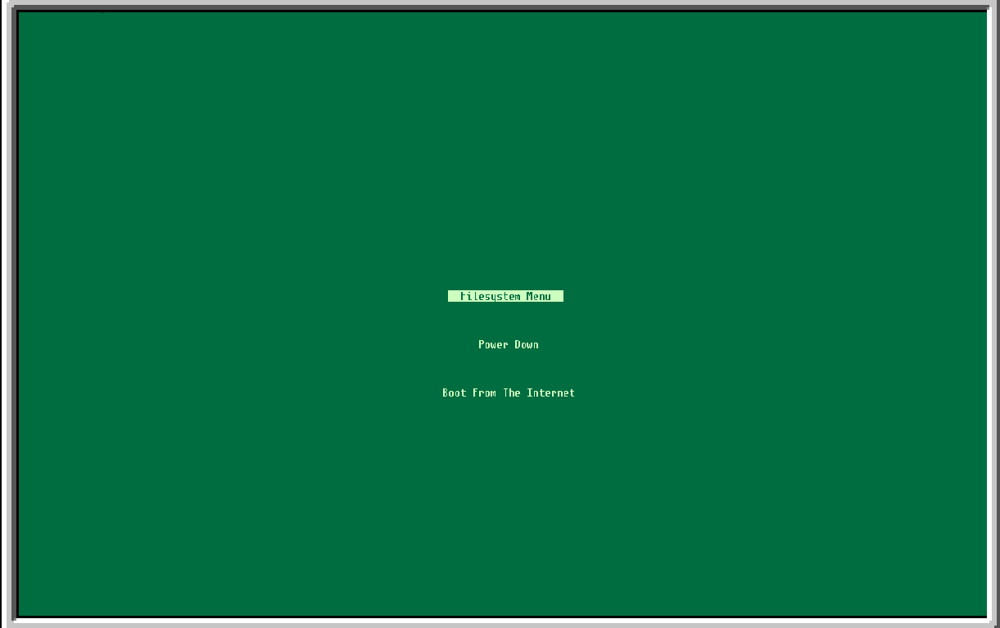
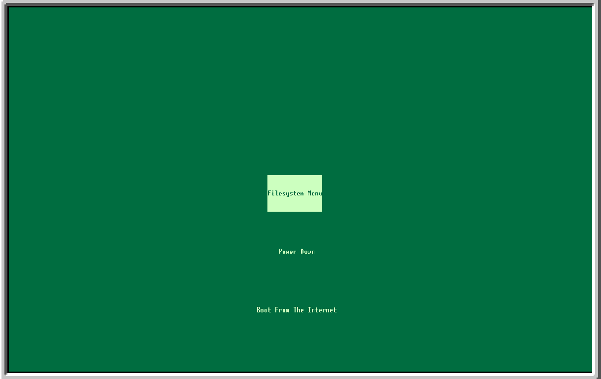

## DoorEFI

DoorEFI is the built in EFI / BIOS of DoorOS (does not exist yet). It is considered Work In Progress so please excuse any bugs you might find, and report them through Issues. Suggestions are welcome too !

## Features

- Booting from init.lua / OS.lua files
- Selecting the boot filesystem through a menu using arrow keys
- Booting from a real URL (Work In Progress)
- Customizable UI (Only 160 * 50 resolution though, sorry)

## How to customize your UI (Instructions for OpenOS, for now)

Opening the installer, you will be prompted to optionally select a config file. Additionally, you are going to have to install the crunch compressing software (Third Party, not made by me) for this to work. To do that, you need to install oppm (The doorOS package manager) using its floppy disk, and then just run "oppm install crunch"

 Here is the syntax the config file has to follow :

`local autoBootInterval = 2`  
`local backgroundColor = 0x097A2D`  
`local foregroundColor = 0xC4FFAD`  
`local verticalPadding = 3`  
`local horizontalPadding = 2`  
`local verticalMargin = 2`  

You can change any one of those values.

- The Autoboot interval is the time (in seconds) the EFI hangs expecting a button press before automatically booting
- The background color is well, the background color (in hex)
- The foreground color is the color used for text (in hex)
- The horizontal padding is the effect on the sides of the "Filesystem Menu" text here. This should be an even number

- The vertical padding is the same effect but above and below the button. This should be an odd number though

- The vertical margin is the vertical spacing between 2 buttons, you can see that in the included pictures too.

After you customize this file to your needs you can open it with the installer and kablooey ! It works

# Command to run in OpenOS to open the installer :

`pastebin run QbyHTHQg`
